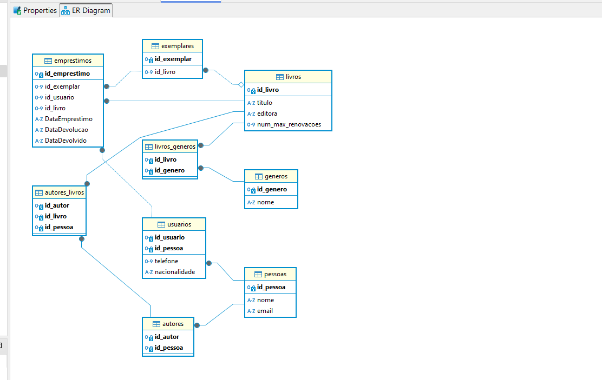

# ExercíciosBancodeDados_SquadSarahGilbert

> Para inspirar, formar e impulsionar

> ## 👩‍💻**Squad Sarah Gilbert**👩‍💻 | 📚 Gerenciamento Biblioteca 📚 | 🗂️ Banco de Dados 🗂️
 
O primeiro passo na elaboração do desafio foi realizar uma conferência online com todos os membros da Squad. Utilizando como base o desafio anterior, fizemos o desenvolvimento do banco de dados do respectivo sistema de Gerenciamento de Biblioteca. Em seguida, elaboramos a modelagem do desafio para visualizar o escopo do banco de dados, se baseando nas instruções fornecidas pela equipe da Womarkers Code.
 
 

### Para otimizar o trabalho colaborativo, as responsabilidades foram atribuidas da seguinte maneira:

➡️ Criação das Tabelas: Cada integrante ficou responsável pela criação de uma tabela específica;

➡️ Inserção de Dados: A inserção de dados foi aberta de forma colaborativa, permitindo que qualquer pessoa pudesse contribuir e adicionar dados na tabela de outra integrante; 

➡️ Consultas SQL: Cada tipo de consulta foi atríbuida a uma participante específica;

➡️ Atualizações e Exclusões: As consultas para atualizar o banco de dados foi designada para uma participante específica, assim como as exclusões. 
 
 
As contribuições foram realizadas através do processo de fork do repositório original, seguido pela criação de uma pull request que passou por uma revisão detalhada e posteriormente, aprovação e merge com a branch principal.
 
 
De maneira geral, o trabalho foi realizado de forma colaborativa, com a participação ativa de todos os membros da equipe. Cada pessoa contribuiu com suas habilidades e conhecimentos, resultando em um projeto bem-sucedido e integrado. 

Com o auxílio do Trello, Git, GitHub, e do canal do Discord do squad, conseguimos trabalhar de forma colaborativa, otimizando o processo de desenvolvimento e aprendizado.

### Abaixo se encontra tabela com as responsáveis e sua(s) respectiva(s) atribuições:

| Integrantes da Equipe  | Tabela(s)| Consulta(s) | Insert(s) |
| ------------- | ------------- | ------------- | ------------- |
| Jessica Caroline Lizar | exemplares | Verificar o número de cópias dos livros e quais exemplares estão emprestados | ✅
| Letícia Almeida | autores e autores_livros | ---- | ✅
| Lívia Boscolo | emprestimos | Encontrar os livros emprestados | ✅
| Michelle Martins da Costa | generos e livros_generos | ---- | ✅
| Nadi Duno | pessoas e usuarios | Exclusões | ✅
| Raquel de Oliveira Maia | livros | Listas os livros disponíveis (criação de tabelas e inserts) | ✅
| Rosana TSF | ---- | Mostrar os empréstimos em atraso | ✅

## Diagrama de modelagem das tabelas: 

## Orientações para sua contribuição com boas práticas:
* Evitar caracteres especiais;
* Sempre realizar um pull da branch principal antes de realizar o PR; 
* Verificar se existem PR's em aberto antes de realizar uma nova;
* Adicionar a extensão ".py" ao nome do arquivo!
